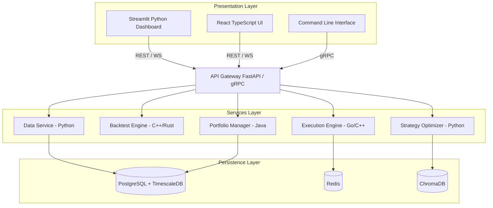

# EvoXAI
**Autonomous Multi-Language Trading Strategy Developer**

EvoXAI is a complete, production-ready, self-improving trading platform that generates, tests, evolves, and explains trading strategies across multiple styles and programming languages. It combines evolutionary algorithms, reinforcement learning, explainable AI, and causal inference into a single autonomous system.

The system is built as a polyglot microservices architecture where each language is used for what it does best: Python for research and AI, C++ and Rust for ultra-low latency execution, Go for high-concurrency matching, Java and C# for enterprise portfolio management.

---

## ⚡ Core Capabilities

- **Automated Research Ingestion:** Ingests research papers, market data, and trade history.
- **Poly-Style Strategy Generation:** Generates strategies across 6 styles: SMC, ICT, Malaysian SnR, Intraday, Swing, Scalping.
- **Massive Scale Backtesting:** Runs 10,000+ backtests per day via Ray-distributed parallel execution.
- **Evolutionary Optimization:** Evolves strategies via genetic algorithms with NSGA-II Pareto optimization.
- **Concept Drift Detection:** Detects concept drift (DDM, EDDM, ADWIN) and adapts strategy pools in real time.
- **Explainable AI (XAI):** Explains every trade decision using SHAP, LIME, and counterfactuals.
- **Causal Inference Engine:** Infers causality with DoWhy and PC algorithm to reject spurious strategies.
- **Multi-Agent Simulation:** Runs 1000+ coevolutionary agents in competitive market simulation.
- **Market Regime Detection:** Detects market regimes using Hidden Markov Models (4 regimes).

---

## 🏗 Architecture Diagram



---

## 💻 Language-to-Layer Matrix

| Language | Primary Layer | Key Libraries | Latency Profile |
|----------|---------------|---------------|-----------------|
| **Python** | Research, AI, ML, Dashboard | VectorBT, Ray, PyTorch, SHAP | 10-100 ms (acceptable) |
| **C++** | HFT Order Execution | Boost.Lockfree, spdlog | < 1 µs |
| **Rust** | Market Data Feed | Tokio, serde, crossbeam | < 500 ns |
| **Go** | Matching Engine | container/heap, sync | < 50 µs |
| **Java** | Portfolio Management | Netty, Commons Math | 1-5 ms |
| **Julia** | Quant Research | Strategems.jl, Statistics | Research-grade |

---

## ⚙️ Prerequisites & Global Setup

**Minimum Requirements:**
- CPU Cores: 8 (Recommended: 16+)
- RAM: 16 GB (Recommended: 32 GB)
- Storage: 50 GB SSD (Recommended: 200 GB NVMe for TimescaleDB)
- Software: Python 3.10+, Git 2.40+
- Optional: Docker 24.x (for full pipeline), CUDA 11.8+ for PyTorch GPU Acceleration

### 0. Lightweight vs Full Mode
EvoXAI can operate in a lightweight experimental mode that uses pure NumPy, EWMA, and local execution without heavyweight dependencies like Ray, VectorBT, or Docker databases.

### 1. Setup Python Virtual Environment
Keep the core analytical side of the system isolated:
```bash
python -m venv venv
# Windows: venv\Scripts\activate
# Unix/MacOS: source venv/bin/activate
pip install -r requirements_core.txt  # Use requirements.txt for full dependencies
```

### 2. Start Full Infrastructure (Optional)
If running the entire framework in production, spin up essential databases and message brokers:
```bash
docker-compose up -d
```
*Tip: Ensure ports 5432 (Postgres), 6379 (Redis), 8000/8001 (ChromaDB), and 5672 (RabbitMQ) are free on your machine.*

Once TimescaleDB is running, apply the necessary schema structures out of the box:
```bash
PGPASSWORD=evoxai123 psql -h localhost -U evoxai -d evoxai_db -f db/schema.sql
```

---

## 🚀 Quick-Start Guide

Once the foundation is running, you can activate the intelligence pipeline:

**Step 1: Run the Smoke Test (Verification)**
```bash
python run_test.py
```
*This performs an isolated single-cycle test fetching live BTC-USD data, evolving strategies, generating agents, evaluating regimes, and outputting an XAI decision.*

**Step 2: Download Market Data**
```bash
python data/market_data_fetcher.py
```

**Step 3: Start the Main Orchestrator**
```bash
python orchestrator/main.py
```

**Step 4: Spin up the Local Analytics Dashboard**
```bash
streamlit run dashboard/app.py
```

---

## 🔧 Building Native Microservices

To compile your highly performant execution subsystems:

- **C++**: `cd services/cpp && mkdir build && cd build && cmake .. -DCMAKE_BUILD_TYPE=Release && make -j8`
- **Rust**: `cd services/rust && cargo build --release`
- **Go**: `cd services/go && go build ./...`
- **Java**: `cd services/java && mvn clean package -DskipTests`

*Alternatively, execute `make all` from the project root if you are under a Unix environment.*

---

## 🧪 Testing
The framework comes packaged with language-specific test suites spanning the codebase:
```bash
# General full suite run via Make
make test

# Python Unit Testing
pytest tests/ -v

# Rust Fast Paths Checking
cd services/rust && cargo test

# Go Routines Validation
cd services/go && go test ./...
```

---
*EvoXAI — Build. Evolve. Explain. Profit.*
